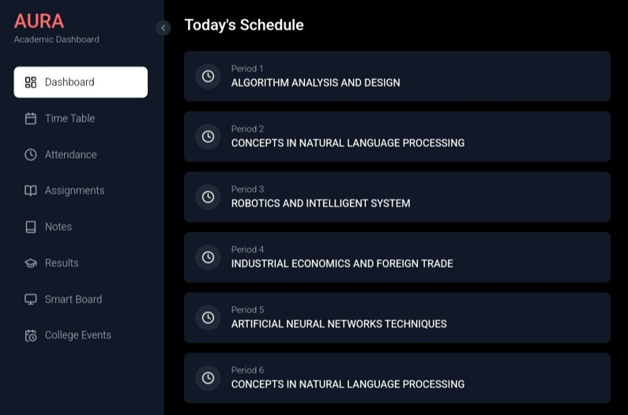

# AURA - Academic Utility and Resource Assistant 🎓✨

AURA is a one-stop academic platform built to enhance students' productivity and streamline college life. It offers real-time attendance tracking, integrated timetable management, deadline reminders, AI-powered learning tools, and more—all in one intuitive interface.

## 🚀 Features

- 📅 **Timetable Integration**  
  Automatically fetches your class schedule for easy viewing and planning.

- 📊 **Real-Time Attendance Tracker**  
  Syncs with ETLab to give up-to-date attendance info across subjects.

- 📌 **Assignment & Exam Deadline Notifications**  
  Keeps you informed about upcoming assignments and tests.

- 🧠 **AI-Powered Smart Board**  
  Get academic insights and help using Gemini API for a dynamic learning experience.

- 📚 **Assignment Assistance**  
  Suggests references and help for your assignments using the Cohere API.

- 🧾 **ETLab Integration**  
  Seamlessly scrapes ETLab to sync your academic data in real-time.

- 👨‍🏫 **Role-Based Access**  
  Admin replaced with Professor role to interact with ETLab. Tutor role excluded.

---

## 🛠️ Tech Stack

- **Frontend**: React.js, Tailwind CSS, Lucide-React, Framer Motion  
- **Backend & API**: GitHub API (for academic resource management)  
- **Scraping**: Python scripts deployed on Render.io (for ETLab)  
- **AI Integration**: Gemini API, Cohere API  
- **Hosting**: Netlify

---

## 📷 UI Previews

### 🧭 Dashboard View


### 📅 Timetable Interface


### 📊 Attendance Tracker

---

## 📦 Installation

```bash
# Clone the repository
git clone https://github.com/your-username/AURA.git
cd AURA

# Install dependencies
npm install

# Start the development server
npm run dev
